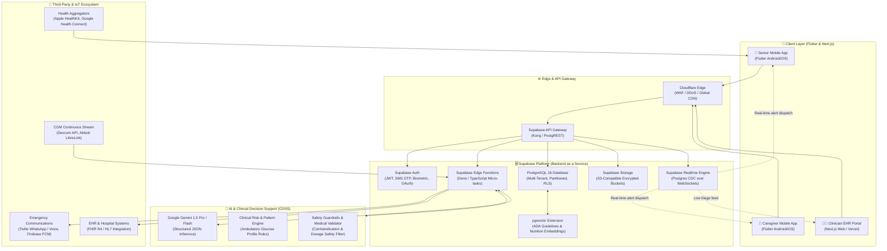
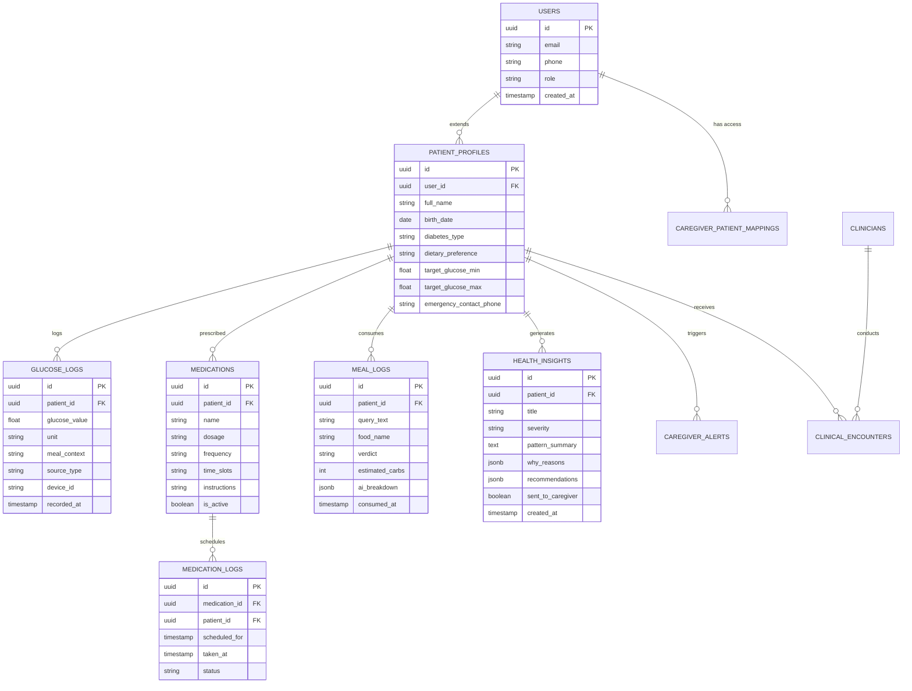
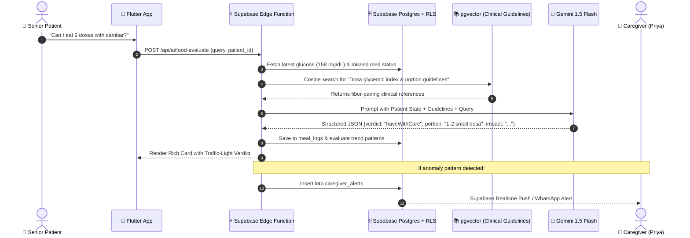
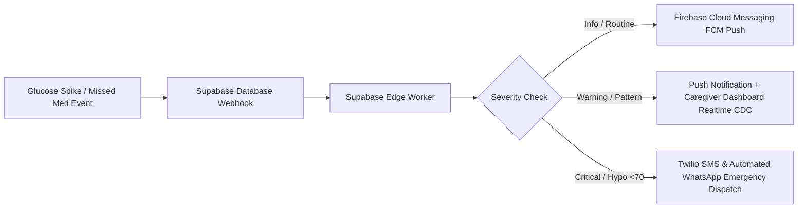

# 🏛️ GlucoCare AI — Final Production System Architecture

> **Comprehensive Technical Architecture for Scalable, HIPAA-Compliant, Explainable Geriatric Diabetes Care**  
> *Backend & Database Powered by **Supabase (PostgreSQL, Realtime, Auth, RLS, Edge Functions, pgvector)***

---

## 📑 Table of Contents
1. [Executive Architectural Overview](#1-executive-architectural-overview)
2. [High-Level System Architecture Diagram](#2-high-level-system-architecture-diagram)
3. [Client Applications & Multi-Portal Ecosystem](#3-client-applications--multi-portal-ecosystem)
4. [Supabase Backend & PostgreSQL Schema Design](#4-supabase-backend--postgresql-schema-design)
5. [AI / LLM & Clinical Intelligence Engine](#5-ai--llm--clinical-intelligence-engine)
6. [IoT, CGM & Wearable Ingestion Pipeline](#6-iot-cgm--wearable-ingestion-pipeline)
7. [Real-Time Notification & Alert Dispatch Pipeline](#7-real-time-notification--alert-dispatch-pipeline)
8. [Security, Privacy & HIPAA/FHIR Compliance](#8-security-privacy--hipaafhir-compliance)
9. [Infrastructure, DevOps & Deployment Strategy](#9-infrastructure-devops--deployment-strategy)

---

## 🌟 1. Executive Architectural Overview

The production architecture of **GlucoCare AI** is built on a **Cloud-Native, Event-Driven, Reactive Backend** that connects three stakeholder personas:
1. **👴 Senior Citizen Patients**: Mobile App with simplified voice/touch interfaces, offline-first sync, and large tactile widgets.
2. **👩 Family Caregivers**: Dedicated mobile/web view receiving instant real-time alerts, weekly trend summaries, and remote medication check-in.
3. **👨‍⚕️ Clinicians & Endocrinologists**: HIPAA-compliant Web Portal with AGP (Ambulatory Glucose Profile) charts, AI-annotated anomaly feeds, and EHR/FHIR integration.

```
                   ┌───────────────────────────────────────┐
                   │           CLIENT PLATFORMS            │
                   │  👴 Senior App  👩 Caregiver  👨‍⚕️ Clinic│
                   └──────────────────┬────────────────────┘
                                      │ (HTTPS / WSS)
                                      ▼
                   ┌───────────────────────────────────────┐
                   │      API GATEWAY / CLOUDFLARE         │
                   │  SSL Termination • DDoS • WAF • CDN   │
                   └──────────────────┬────────────────────┘
                                      │
            ┌─────────────────────────┴─────────────────────────┐
            ▼                                                   ▼
┌───────────────────────────────────────┐   ┌───────────────────────────────────────┐
│          SUPABASE BACKEND             │   │        AI CLINICAL MICROSERVICE       │
│ • PostgreSQL 16 (Relational + Vector) │   │ • Google Gemini 1.5/2.0 Flash / Pro   │
│ • Row Level Security (RLS)            │   │ • RAG with pgvector Clinical Guides   │
│ • Supabase Realtime (WebSockets / CDC)│◄──┤ • Deterministic Rule Engine           │
│ • Supabase Auth (MFA, Phone, Biometric│   │ • Explainable Root-Cause Synthesizer  │
│ • Supabase Storage (Encrypted Assets) │   │ • Fast-Acting Hypoglycemia Safety Guard│
│ • Supabase Edge Functions (Deno/TS)   │   │ • Prompt Guardrails & Hallucination Filter
└──────────────────┬────────────────────┘   └───────────────────────────────────────┘
                   │
                   ▼
┌───────────────────────────────────────────────────────────────────────────────────┐
│                             EXTERNAL INTEGRATIONS                                 │
│ • Dexcom / Libre CGM Webhooks  • Twilio / WhatsApp Business API  • Firebase FCM  │
│ • Apple Health / Health Connect • Epic / Cerner EHR (FHIR HL7 API) • Resend Email │
└───────────────────────────────────────────────────────────────────────────────────┘
```

---

## 📊 2. High-Level System Architecture Diagram



---

## 📱 3. Client Applications & Multi-Portal Ecosystem

### 3.1 Senior Citizen Mobile App (Flutter)
* **Design Tenet**: Zero cognitive friction, maximum visual clarity, tactile haptic feedback.
* **Offline First**: Local caching with automatic delta synchronization via SQLite/Drift and Supabase Realtime CDC.
* **Voice Ingestion**: Integrated Whisper / Native Speech-to-Text allowing seniors to speak in native languages (*"Maine do roti aur daal khayi"*).
* **Emergency Mode**: Instant prominent SOS trigger dispatching geolocation and last vitals to caregiver.

### 3.2 Caregiver App (Flutter / Web)
* **Real-time Synchronization**: Subscribed to Supabase Realtime channel `patient_alerts:patient_id`.
* **Remote Check-ins**: Trigger friendly nudge notifications (*"Rajesh, don't forget your evening Metformin"*).
* **Weekly Health Digests**: Automated AI-generated narrative summaries of glycemic stability and medication compliance.

### 3.3 Clinician Portal (Next.js 15 / React / Tailwind)
* **Standard Ambulatory Glucose Profile (AGP)**: Time in Range (TIR: 70–180 mg/dL), Time Below Range (TBR: <70 mg/dL), Glycemic Variability (CV %).
* **AI Clinical Summaries**: 1-click exportable PDF/FHIR clinical progress notes formatted for hospital EHR upload.

---

## 🗄️ 4. Supabase Backend & PostgreSQL Schema Design

### 4.1 Database Architecture Highlights
* **Row-Level Security (RLS)**: Enforces strict tenant boundaries ensuring patient data is only accessible by authorized patients, linked caregivers, and accredited doctors.
* **Database Partitioning**: Time-series partitioning (`PARTITION BY RANGE (recorded_at)`) on high-frequency glucose logs.
* **pgvector**: Integrated vector database storing ADA (American Diabetes Association) and RSSDI clinical guidelines for Retrieval-Augmented Generation (RAG).



### 4.2 Core Supabase SQL Schema (DDL with RLS)

```sql
-- Enable Extensions
CREATE EXTENSION IF NOT EXISTS "uuid-ossp";
CREATE EXTENSION IF NOT EXISTS "vector";

-- 1. Patients Table
CREATE TABLE public.patient_profiles (
    id UUID PRIMARY KEY DEFAULT uuid_generate_v4(),
    user_id UUID REFERENCES auth.users(id) ON DELETE CASCADE NOT NULL,
    full_name TEXT NOT NULL,
    age INT NOT NULL,
    diabetes_type TEXT NOT NULL DEFAULT 'Type 2',
    dietary_preference TEXT NOT NULL DEFAULT 'Vegetarian',
    target_glucose_min NUMERIC(5,2) DEFAULT 90.0,
    target_glucose_max NUMERIC(5,2) DEFAULT 140.0,
    created_at TIMESTAMPTZ DEFAULT NOW(),
    updated_at TIMESTAMPTZ DEFAULT NOW()
);

-- 2. Glucose Readings (Time-series Partitioned)
CREATE TABLE public.glucose_logs (
    id UUID DEFAULT uuid_generate_v4(),
    patient_id UUID REFERENCES public.patient_profiles(id) ON DELETE CASCADE NOT NULL,
    glucose_value NUMERIC(5,2) NOT NULL, -- mg/dL
    meal_context TEXT NOT NULL,          -- fasting, before_meal, after_meal, bedtime
    source_type TEXT NOT NULL DEFAULT 'manual', -- manual, dexcom, libre, health_kit
    notes TEXT,
    recorded_at TIMESTAMPTZ NOT NULL DEFAULT NOW(),
    created_at TIMESTAMPTZ DEFAULT NOW(),
    PRIMARY KEY (id, recorded_at)
) PARTITION BY RANGE (recorded_at);

-- 3. Caregiver Mapping Table
CREATE TABLE public.caregiver_patient_mappings (
    id UUID PRIMARY KEY DEFAULT uuid_generate_v4(),
    caregiver_user_id UUID REFERENCES auth.users(id) ON DELETE CASCADE NOT NULL,
    patient_id UUID REFERENCES public.patient_profiles(id) ON DELETE CASCADE NOT NULL,
    relationship TEXT NOT NULL, -- 'Daughter', 'Son', 'Spouse', 'Nurse'
    can_receive_emergency_sms BOOLEAN DEFAULT TRUE,
    created_at TIMESTAMPTZ DEFAULT NOW(),
    UNIQUE(caregiver_user_id, patient_id)
);

-- 4. Enable Row Level Security (RLS)
ALTER TABLE public.patient_profiles ENABLE ROW LEVEL SECURITY;
ALTER TABLE public.glucose_logs ENABLE ROW LEVEL SECURITY;
ALTER TABLE public.caregiver_patient_mappings ENABLE ROW LEVEL SECURITY;

-- Patients can only read & write their own records
CREATE POLICY "Patients manage own profile"
    ON public.patient_profiles
    FOR ALL
    USING (auth.uid() = user_id);

CREATE POLICY "Patients manage own glucose"
    ON public.glucose_logs
    FOR ALL
    USING (
        patient_id IN (
            SELECT id FROM public.patient_profiles WHERE user_id = auth.uid()
        )
    );

-- Caregivers can view mapped patient data
CREATE POLICY "Caregivers view patient glucose"
    ON public.glucose_logs
    FOR SELECT
    USING (
        patient_id IN (
            SELECT patient_id FROM public.caregiver_patient_mappings 
            WHERE caregiver_user_id = auth.uid()
        )
    );
```

---

## 🧠 5. AI / LLM & Clinical Intelligence Engine

The AI subsystem operates on a **hybrid dual-layer design**:
1. **Deterministic Rule Engine (Sub-10ms)**: Evaluates high-risk clinical conditions (hypoglycemia <70 mg/dL, severe spikes >250 mg/dL, consecutive missed medications) with zero hallucination risk.
2. **Generative LLM Engine (Google Gemini 1.5 Flash/Pro + RAG)**: Synthesizes personalized nutrition advice, natural-language food answers, and explainable root-cause narratives.



### 🛡️ Medical Safety & Hallucination Guardrails
* **No Diagnostic Authority**: Prompts include strict system-level constraints barring the AI from changing prescription dosages or declaring formal diagnoses.
* **Clinical Confidence Score**: If the LLM confidence or knowledge base similarity is low, the response automatically suggests consulting the treating physician.
* **Hypoglycemia Fast-Path**: Any query mentioning dizziness, sweating, tremors, or glucose <70 mg/dL immediately bypasses generative processing and displays the standard **Rule of 15** emergency protocol.

---

## 📡 6. IoT, CGM & Wearable Ingestion Pipeline

To scale beyond manual logging, the final product ingests continuous data from clinical sensors:
* **CGM Ingestion (Dexcom API / Abbott FreeStyle LibreLink)**: Webhook receivers hosted on Supabase Edge Functions polling / receiving 5-minute interstitial glucose values.
* **Smart Glucometer (Bluetooth LE)**: Web Bluetooth / Flutter BLE plugin connecting to Accu-Chek, Contour Next, or OneTouch glucometers.
* **Activity & Sleep (Apple HealthKit & Google Health Connect)**: Background step count, heart rate, and sleep duration syncing to evaluate post-meal activity.

---

## 🚨 7. Real-Time Notification & Alert Dispatch Pipeline



* **WhatsApp Business API (Twilio)**: Seniors and caregivers in developing markets (e.g. India) receive instant actionable alerts directly on WhatsApp with interactive buttons (*"Mark Taken"*, *"View Alert"*).
* **Postgres CDC (Change Data Capture)**: Caregiver dashboards update live within 100ms of any patient event without polling.

---

## 🔒 8. Security, Privacy & HIPAA/FHIR Compliance

| Requirement | Implementation Architecture |
| :--- | :--- |
| **Encryption at Rest** | AES-256 encryption on all PostgreSQL database volumes and Supabase Storage buckets |
| **Encryption in Transit** | TLS 1.3 enforced on all REST, GraphQL, WebSocket, and WebRTC channels |
| **Access Control (RBAC/ABAC)**| Supabase Row-Level Security (RLS) linked with JWT cryptographic user claims |
| **Audit Logging** | Immutable `audit_logs` table tracking every read, write, and export of patient health records (PHI) |
| **FHIR Standard Compatibility** | REST mapping to HL7 FHIR R4 standard (`Observation` for glucose, `MedicationStatement` for meds) |
| **Authentication & MFA** | Passwordless biometric authentication (Passkeys/FaceID), SMS OTP, and Magic Links |

---

## ☁️ 9. Infrastructure, DevOps & Deployment Strategy

```
┌─────────────────────────────────────────────────────────────────────────────────────────┐
│                                 INFRASTRUCTURE MAP                                      │
├────────────────────────────┬────────────────────────────┬───────────────────────────────┤
│ Frontend Web / Dashboard   │ Backend & Database         │ AI & External Services        │
│ • Vercel Edge Network      │ • Supabase Enterprise      │ • Google Cloud Vertex AI /    │
│ • Cloudflare Global CDN    │ • Managed AWS Postgres 16  │   Gemini API                  │
│ • Custom Domain SSL        │ • Multi-AZ High Avail.     │ • Twilio WhatsApp Business    │
│ • Automatic CI/CD Previews │ • Daily Point-in-Time Backup│ • Firebase FCM Push Cluster   │
└────────────────────────────┴────────────────────────────┴───────────────────────────────┘
```

### 🚀 CI/CD Pipeline
* **GitHub Actions**:
  1. `Lint & Analyze`: `flutter analyze` + `eslint` on web portal.
  2. `Test Suite`: Automated unit, integration, and widget tests (`flutter test`).
  3. `Build & Deploy`: Production Docker images and Vercel edge deployment for web; Fastlane distribution for Android Play Store & iOS TestFlight.
